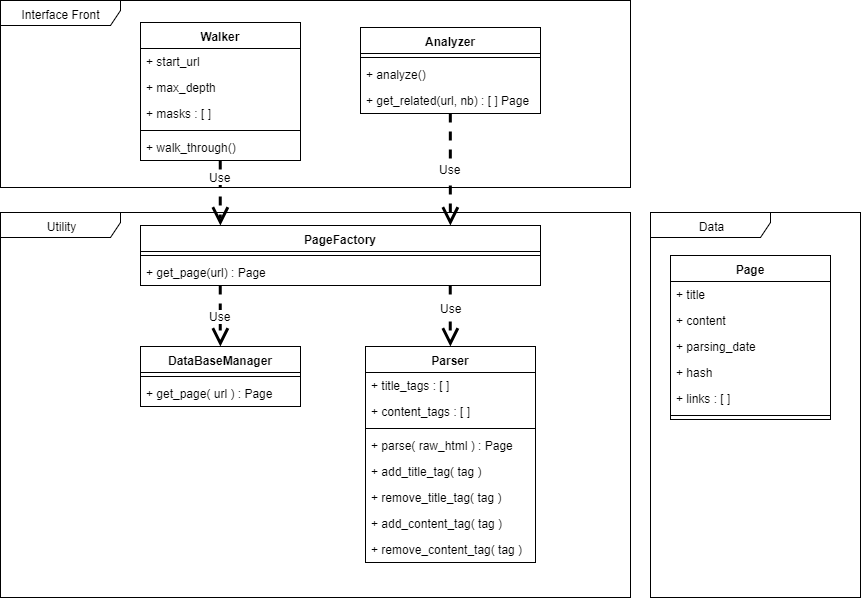

# Webreex
Web relations explorer

## Reading

https://fr.wikipedia.org/wiki/TF-IDF

https://fr.wikipedia.org/wiki/Mod%C3%A8le_de_Markov_cach%C3%A9

## Challenges

 - Retrieving all the text from a website
 - Which quality criterion should we optimise ?
 - We have to think about how to prepare data for training (tf-idf, removing redundant word, ...)
 - Which model should we use (based on the quality creterion)
 - How to deal with incremental change and clustering ?
 - Who let the dogs out ?

## UML Diagram

